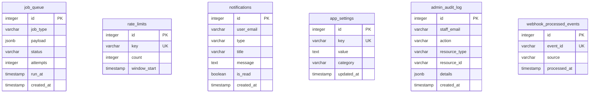

# Database Entity Relationship Diagrams

This document provides focused views of the database schema for different audiences. Each diagram shows only the relevant tables for that particular domain.

> **Note:** These focused diagrams intentionally show only a subset of tables. For the complete schema, see the "Full Schema Reference" section at the bottom. Some views include substitutions where requested tables don't exist in the current schema.

---

## 1. Core Business Diagram

**Audience:** Non-technical stakeholders, product managers, operations team

This is the cleanest view - showing only what business stakeholders care about: Who are the members, what do they book, and what activities are available?

### What This Shows
- **Members** belong to a membership tier that determines benefits
- **Bookings** reserve simulator bays (resources) for specific time slots
- **Sessions** represent actual usage of the bays
- **Events** are club activities that members can RSVP to attend

---

## 2. Finance & Billing Diagram

**Audience:** Developers working on payments, billing team, finance staff

This view focuses purely on money flow: How members pay, billing group structures, and payment tracking.

> **Schema Note:** There is no separate `invoices` table. Invoice management is handled directly in Stripe. The `stripe_payment_intents` table tracks payment attempts and the `booking_fee_snapshots` table captures calculated fees.

### What This Shows
- **Billing Groups** handle family/corporate unified billing (one person pays for multiple members)
- **Stripe Payment Intents** track all payment attempts and completions
- **Booking Fee Snapshots** capture calculated fees at booking time (serves as "invoice" data)
- **Day Passes** are one-time purchases for non-members

---

## 3. Integrations Diagram

**Audience:** Developers working on external service connections

This view shows how data maps to external services: HubSpot CRM, Trackman simulators, and Stripe.

> **Schema Note:** There is no separate `stripe_customers` table. Stripe customer IDs are stored in `billing_groups.primary_stripe_customer_id`.

### What This Shows
- **HubSpot Deals** track membership sales in CRM (synced from Stripe subscriptions)
- **Billing Groups** store Stripe customer IDs for payment integration
- **Trackman Bay Slots** map simulator bays to Trackman's booking system
- **Trackman Import Runs** log CSV import history from Trackman exports

---

## 4. System Internals Diagram

**Audience:** Backend engineers, DevOps, debugging infrastructure issues

This view covers operational tables for debugging and monitoring.

> **Schema Note:** There is no `error_logs` table. Error logging is handled via structured `console.error` calls that appear in server runtime logs.

### What This Shows
- **Job Queue** handles background tasks (emails, syncs, cleanup)
- **Rate Limits** prevent API abuse by tracking request counts
- **Notifications** are in-app alerts delivered to users
- **App Settings** store configurable values (feature flags, etc.)
- **Admin Audit Log** tracks all staff actions for compliance
- **Webhook Events** ensures external events are processed exactly once

---

## Full Schema Reference

For the complete database schema with all 70+ tables, see below. This is the authoritative reference for all tables and relationships.

Click to expand full schema

---

## Table Summary

| Category | Tables | Count |
|----------|--------|-------|
| **Core Users & Membership** | users, staff_users, membership_tiers, tier_features, tier_feature_values, billing_groups, group_members, family_add_on_products | 8 |
| **Resources & Availability** | resources, availability_blocks, trackman_bay_slots, facility_closures, closure_reasons | 5 |
| **Bookings** | booking_requests, booking_sessions, booking_participants, booking_members, booking_guests, booking_fee_snapshots, booking_payment_audit | 7 |
| **Guests & Passes** | guests, guest_passes, guest_check_ins, pass_redemption_logs | 4 |
| **Day Passes** | day_pass_purchases | 1 |
| **Events** | events, event_rsvps | 2 |
| **Wellness** | wellness_classes, wellness_enrollments | 2 |
| **Payments & Stripe** | stripe_payment_intents, stripe_products, stripe_transaction_cache, discount_rules | 4 |
| **HubSpot Integration** | hubspot_deals, hubspot_line_items, hubspot_product_mappings, hubspot_form_configs, hubspot_sync_queue, dismissed_hubspot_meetings | 6 |
| **Tours** | tours | 1 |
| **Communication** | communication_logs, notifications, announcements, notice_types, user_dismissed_notices, push_subscriptions, email_events, member_notes | 8 |
| **Authentication** | sessions, magic_links, user_linked_emails | 3 |
| **TrackMan Integration** | trackman_import_runs, trackman_unmatched_bookings, trackman_webhook_events, trackman_webhook_dedup | 4 |
| **Admin & Audit** | admin_audit_log, billing_audit_log, account_deletion_requests, data_export_requests, bug_reports, form_submissions | 6 |
| **Content & Settings** | app_settings, system_settings, faqs, gallery_images, training_sections, cafe_items | 6 |
| **System & Jobs** | job_queue, rate_limits, webhook_processed_events | 3 |
| **Integrity & Legacy** | integrity_check_history, integrity_issues_tracking, integrity_ignores, integrity_audit_log, legacy_import_jobs, legacy_purchases, usage_ledger | 7 |
